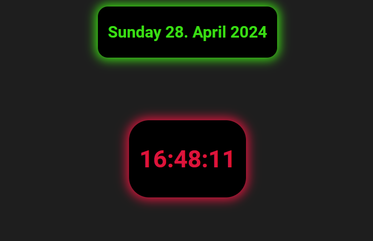

# Simple Clock App

This is a simple clock app that displays the current time and date.

## Features

- Displays the current time in hours, minutes, and seconds.
- Shows the current date including the day, month, and year.

## Technologies Used

- React: Utilized for building the user interface.
- CSS: Styles the appearance of the clock app.
- JavaScript: Used within React components to update the time and date dynamically.

## Development

If you want to make modifications or improvements to the clock app, feel free to fork the repository and make changes as needed.

## License

MIT

## Author

Eirik Andresen
